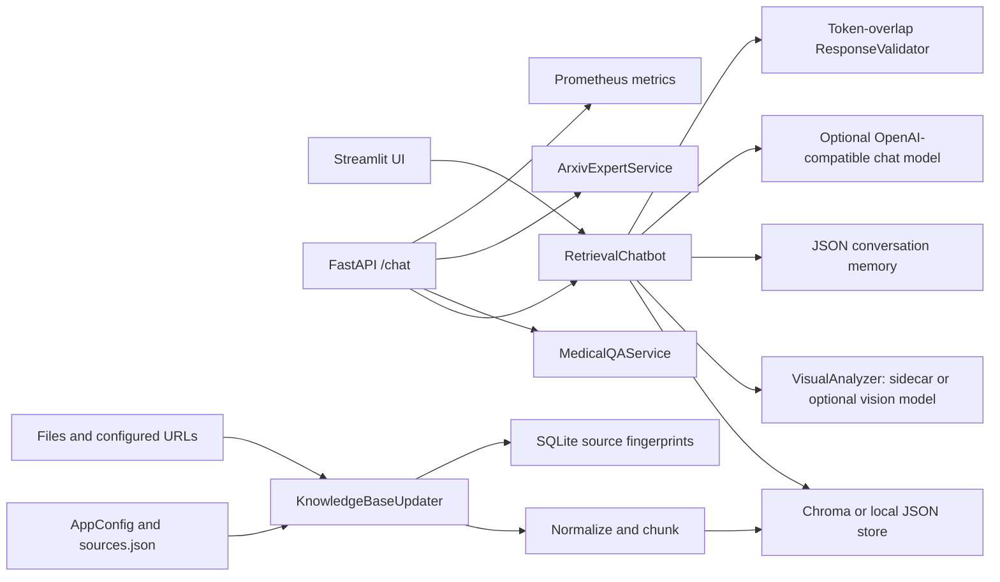
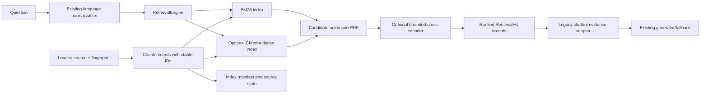

# Billie Implementation Plan

**Status:** Milestone 1 complete. Milestone 2 Phase 1 design submitted; no Milestone 2 implementation has started and Phase 2 is pending approval.  
**Audit snapshot:** 2026-09-26  
**Scope:** Improve the existing Billie application incrementally. Preserve working behavior and the checked-in historical evaluation artifacts.

## 1. Verified Architecture

Billie is a Python application with two entry points. [streamlit_app.py](../streamlit_app.py) is the interactive demo; [app/main.py](../app/main.py) defines `create_app()` and builds a FastAPI service container. The documented API command is `uvicorn app.main:create_app --factory`. The Docker image starts this API on port 8000; it does not start Streamlit.

### Request paths

- **General chat:** UI/API input -> `RetrievalChatbot.answer()` -> language and sentiment heuristics -> text retrieval -> optional image sidecar/vision processing -> recent JSON memory -> ambiguity check -> optional OpenAI-compatible LLM or deterministic fallback -> token-overlap validation -> response and memory persistence.
- **Medical:** UI/API input -> `MedicalQAService.answer()` -> MedQuAD token-vector cosine retrieval -> fixed-vocabulary entity recognition -> dataset answer and disclaimer. The API currently returns only a subset of the service result.
- **Research:** UI/API input -> `ArxivExpertService.answer()` -> recent-question concatenation -> token-vector cosine paper search -> extractive summary and concept extraction -> optional Ollama explanation. The API returns paper IDs as sources but omits the UI's paper metadata and concepts.
- **Index refresh:** startup/manual/scheduled call -> configured file or URL loader -> SHA-256 fingerprint -> whitespace normalization and overlapping chunks -> replace chunks in configured store -> write source fingerprint and timestamp to SQLite.

## 2. Feature Verification

| Feature | Status | Verified behavior and gap |
|---|---|---|
| FastAPI and Streamlit entry points | IMPLEMENTED | Factory and Streamlit `main()` exist; API routes are covered by `TestClient`, and a disposable sample-only project was started with the documented Uvicorn factory command and probed successfully. Streamlit is separately documented. |
| General retrieval | PARTIALLY IMPLEMENTED | Persistent Chroma integration exists but is optional and was not installed/exercised. Local fallback and benchmark retrievers use term-frequency cosine, not dense semantic embeddings. The benchmark's `CosineRetriever` is lexical. |
| BM25, hybrid retrieval, reranking | MISSING | No BM25, RRF/hybrid candidate fusion, or reranking implementation or test exists. |
| Source ingestion and refresh | IMPLEMENTED | File/HTML loading, retries, chunking, fingerprints, SQLite state, manual sync and scheduler exist. Source deletion reconciliation and interrupted/incompatible-index behavior are untested. |
| Image input/evidence | PARTIALLY IMPLEMENTED | Streamlit upload, sidecars, and OpenAI-compatible vision adapter exist. No uploaded-file size/content validation exists; API accepts arbitrary server paths. The actual live vision-model path is NOT VERIFIED. |
| Multimodal benchmark | BROKEN | Dataset references `dataset/visual_cases/*.png`, but `dataset/visual_cases/` is absent in this checkout. Current benchmark therefore exercises missing-file fallback, not image understanding. |
| Response grounding | PARTIALLY IMPLEMENTED | `ResponseValidator` measures token overlap and ambiguity markers; it does not validate claim entailment or citations. A no-image-extractor fallback can be marked grounded because the fallback response repeats tokens from its own path-based evidence summary. LLM validation is computed before a potentially substituted fallback answer and may not describe the final answer. |
| Conversation memory | PARTIALLY IMPLEMENTED | JSON persistence and an in-process lock work for basic single-process use. Writes are not atomic, locking does not coordinate multiple processes, there is no retention bound, and a caller can select another session ID. |
| Medical QA | PARTIALLY IMPLEMENTED | XML/sample parsing and lexical retrieval exist. Milestone 1 now emits sentence-case lexicon labels, preserves canonical dataset focus spelling, and tests case-insensitive duplicate collapse. Alternate sibling-answer XML parsing remains ineffective because `_parent_map` always returns `{}`. |
| arXiv research | PARTIALLY IMPLEMENTED | Dataset filtering, lexical retrieval, extraction, summaries and DOT output exist. Ollama is optional and NOT VERIFIED. The Docker context now allows the small fallback sample, but the image has not been built. |
| Language handling | PARTIALLY IMPLEMENTED | Four language labels are implemented through script checks and small lexicons. Default path only performs term substitution/prefix adaptation; NLLB is optional and NOT VERIFIED. Saved eight-example evaluation contains English only. |
| Sentiment handling | PARTIALLY IMPLEMENTED | Fixed word lists, local negation window, and answer prefixes exist. The ten-example score is narrow and does not establish real-world sentiment performance. |
| API/admin authorization | PARTIALLY IMPLEMENTED | Configured keys are enforced and tested. If unset, `AuthManager` permits access. No test covers fail-open deployment behavior. |
| URL ingestion security | PARTIALLY IMPLEMENTED | Only static configured sources currently reach the loader, but redirects are followed and destination addresses are not checked. Treat as SSRF exposure if source configuration can be influenced by an untrusted party or deployment input. |
| Prompt-injection handling | MISSING | Retrieved documents, image observations and conversation text are interpolated into the model request. No explicit untrusted-content isolation or injection evaluation exists. There are no tool calls, but model output remains untrusted. |
| Metrics and health | PARTIALLY IMPLEMENTED | Prometheus HTTP count/latency and application counters exist. `/health` always returns `ok`; it does not check store/model readiness. No request-correlated structured logs or retrieval/model latency metrics exist. |
| Docker | PARTIALLY IMPLEMENTED, NOT BUILT | Image is configured to run FastAPI on port 8000. `.dockerignore` allows only the small MedQuAD and arXiv fallback samples and excludes full corpora, mutable data, and `.env`. Docker CLI is unavailable here, so image build/runtime remain unverified. Streamlit is not containerized. |
| CI | IMPLEMENTED, LIMITED | GitHub Actions installs primary requirements and runs pytest on Python 3.12 with `MPLBACKEND=Agg`. It does not run lint/type checks, install NLTK WordNet data, or exercise optional backends. |
| Setup/dependency documentation | IMPLEMENTED FOR MILESTONE 1 | `requirements.txt` remains the sole dependency manifest; no `pyproject.toml`, setup file or lockfile exists. README and developer guides now use the Python 3.12 setup and `uvicorn app.main:create_app --factory` entry point. |

### Backend and dependency paths

| Path | Selection mechanism | Phase Zero verification |
|---|---|---|
| Local JSON term-cosine index | `VECTOR_STORE_BACKEND=local`, or fallback after any Chroma initialization exception | Code inspected; core suite passes relevant non-Chroma paths. |
| Chroma/Sentence Transformers | Optional `requirements-chroma.txt`; implicit `all-MiniLM-L6-v2` model | NOT VERIFIED; optional dependencies/model are not part of the installed primary requirements. Broad exception handling can silently change backend. |
| OpenAI-compatible generation and image inspection | `OPENAI_API_KEY` and configurable base URL/model | NOT VERIFIED; no credential-backed external request was made. |
| Ollama research explanation | UI toggle plus Ollama service at configured/default URL | NOT VERIFIED; API wiring constructs the service with local LLM disabled. |
| NLLB translation | `MULTILINGUAL_TRANSLATION_BACKEND=nllb` | NOT VERIFIED; optional large model/dependencies not installed. |
| Deterministic fallback | Used when no general LLM is configured or an LLM attempt raises; research uses extractive response if Ollama is off/fails | Code path and offline tests exercised. |

## 3. Baseline and Audit Evidence

### Environment and tests

- The existing `.venv-1` is Python 3.14.3 and initially contained only pip; the older `.venv` launcher pointed to a missing Python 3.12 installation. Python 3.12.10 was installed using the Python Install Manager, and the pinned `requirements.txt` was installed in a temporary venv under `%TEMP%\billie-phase-zero-py312`.
- The latest full suite run passes with **29 passed, 0 failed, 0 skipped, 0 errors** in 9.35 seconds using Python 3.12.10 and explicit `MPLBACKEND=Agg`. The run emitted 15 upstream deprecation warnings from Starlette/AnyIO and Matplotlib/Pyparsing.
- `tests/conftest.py` selects Matplotlib's Agg backend for tests, and CI sets the same variable. Benchmark/evaluation tests now write to temporary directories. API tests inject bundled sample services instead of loading the full local corpora for route tests.
- NLTK WordNet data was unavailable; the existing tokenizer fallback without lemmatization was exercised. Chroma, live LLM/vision, Ollama, NLLB, and Docker were not exercised.
- Medical vocabulary-derived entities now use sentence case, canonical dataset `focus` strings are retained, and duplicate same-category labels collapse case-insensitively. Regression tests cover disease/symptom/treatment labels, casing, duplicate collapse, canonical focus, and empty dataset responses.

### Historical artifacts versus fresh reproduction

The checked-in artifact files are historical and remain unchanged. Current evaluation scripts accept `--results-dir`, default to `docs/evaluation/baseline-2026-09-26/`, and emit per-query retrieval and multimodal diagnostics there.

| Evaluation | Historical checked-in result | Fresh sandbox result / audit conclusion |
|---|---|---|
| Text retrieval (`experiments/benchmark_dataset.json`, 5 rows) | Keyword top-1/top-3 `1.0/1.0`, keyword recall `0.800`; “CosineOverlap” `1.0/1.0`, keyword recall `0.833` | Current: keyword variant `1.0/1.0`, `0.800`; lexical “CosineOverlap” `1.0/1.0`, `0.733`. Expected source was rank 1 on all five queries; expected-keyword recall gaps are recorded per query. No held-out split; remote source excluded. |
| Multimodal (4 rows) | Both variants keyword recall `0.0`, clarification accuracy `0.75`; grounded rate `0.0` text-only / `0.5` multimodal | Same numeric values reproduced, but multimodal results are explicitly blocked because all three referenced PNGs are absent. The outputs are fallback behavior, not image-understanding results. |
| Language (8 rows) | Accuracy and normalized-term recall `1.0` | Reproduced; every evaluation row is English, so no evidence about Spanish/Hindi/Bengali detection or translation. |
| Sentiment (10 rows) | Accuracy `0.800`, macro F1 `0.806`, prefix appropriateness `1.0` | Reproduced in sandbox with headless Matplotlib. Prefix appropriateness is a deterministic implementation check, not a human assessment. |

Historical and current values are preserved separately in [the dated baseline report](evaluation/baseline-2026-09-26/REPORT.md). No current Chroma, live LLM/vision, Ollama or NLLB path was evaluated. Missing visual fixtures and the language dataset's imbalance are dataset-validity blockers, not model-performance conclusions.

## 4. Prioritized Gap Analysis

### P0: Contain before public exposure

1. **Unauthenticated deployments:** empty API/admin secrets disable authentication. Decide whether production must fail startup closed or whether an explicit development mode is sufficient. Relevant code: `AuthManager.require_api_key`, `AuthManager.require_admin_key`, `AppConfig.load`, `create_app`.
2. **Arbitrary API image paths:** `/chat` accepts `ImageInput.path`; `VisualAnalyzer` reads adjacent JSON, and the LLM client opens that path and may transmit file contents to a configured remote model. Validate image format/size and constrain access to an approved upload root or adopt an upload transport. Relevant code: `ChatRequest`, `ImageInput`, `/chat`, `VisualAnalyzer.analyze`, `OpenAICompatibleLLMClient.analyze_image`.
3. **Remote URL redirects:** `SourceLoader._load_url` follows redirects without restricting schemes, DNS/IP ranges, or redirect destinations. Static source configuration reduces exposure today but does not make arbitrary targets safe.
4. **Untrusted prompt context:** retrieved source text and memory are concatenated into the model prompt. Define trust boundaries and add adversarial prompt-injection tests before trusting generated answers or adding tools.

### P1: Accuracy and deployment correctness

1. The multimodal data files are missing, so the existing benchmark does not test images. Restore/approve a labeled fixture set before claiming multimodal quality.
2. The validator is lexical, can trust tokens repeated from a path-based fallback, and may attach pre-fallback validation to a changed final answer. It is not factual verification.
3. Docker now allows only small medical/arXiv fallback samples into the build context; actual image inclusion and runtime remain unverified because Docker is unavailable.
4. The retrieval benchmark's five source-level questions, source-only accuracy, lack of held-out data, and lexical “CosineOverlap” label do not support robust quality claims.
5. JSON memory is single-process-oriented, unbounded, non-atomic, and session IDs are not bound to authenticated users.
6. The medical casing assertion is fixed and the test suite passes; headless Matplotlib is configured for Windows and CI.

### P2: Missing retrieval/evaluation depth

- No BM25, hybrid RRF, optional reranker, retrieval metadata contract, index compatibility strategy, or evidence-level relevance labels.
- No 100-200-question labeled retrieval set or ranking metrics such as MRR/nDCG; no latency/indexing/resource measurements.
- No claim-level citation checks, entailment verifier, human-reviewed grounding set, or supported/partial/conflict/unanswerable breakdown.
- No language-specific evaluation sets or direct-vs-translation retrieval comparison.
- Tests lack source deletion/update/interruption/index migration, concurrent persistence, image malformed/oversize, auth-disabled, SSRF redirect, model error, and prompt-injection cases.

## 5. Ordered Milestones (Approval Required)

Each milestone is a separate review boundary. Do not begin a milestone until its scope is approved; do not begin the next major milestone until the completed work and evidence are reviewed.

### Milestone 1: Reproducible baseline and current failures

**Objective:** Establish clean Python 3.12 setup, stable entry-point documentation, deterministic current tests and unmodified historical baselines.

**Changed files:** `README.md`, `README_NOVICE.md`, `DEVELOPER.md`, `.github/workflows/ci.yml`, `.dockerignore`, `app/medical_qa.py`, API/domain/evaluation tests, `tests/conftest.py`, four experiment runners, `PROJECT_TECHNICAL_LOG.md`, this plan, and `docs/evaluation/baseline-2026-09-26/` reports.

**Completed:** Set Matplotlib to Agg in pytest and CI; fixed entity display casing at the recognizer while preserving source focus; added tests for categories, duplicate collapse, canonical focus and missing data; injected sample domain services into API tests; made evaluation destinations configurable and defaults versioned; added per-query JSON outputs; documented Python 3.12 setup and separate API/Streamlit entry points; allowlisted only tiny Docker data samples and excluded secrets.

**Acceptance:** Python 3.12.10 with pinned primary requirements verified; full pytest **29 passed, 0 failed, 0 skipped, 0 errors**; benchmark scripts wrote to the versioned directory and left historical artifacts unchanged; per-query report records the `0.833` historical versus `0.733` current cosine keyword recall difference; both `TestClient` and live Uvicorn factory smoke tests passed against sample data; Streamlit command documented separately. Docker build/runtime remains unverified because Docker is unavailable and is not claimed.

### Milestone 2: Retrieval Engineering

**Status:** Phase 1 design only. Implementation, dataset authoring and dependency installation require your approval.

#### 2.1 Current Retrieval Architecture

The current general-chat path is:

1. `RetrievalChatbot.answer()` calls `LanguageDetector.analyze()` and submits `normalized_query` to `VectorStore.search(query, top_k=config.top_k)`.
2. The current `.env` sets `VECTOR_STORE_BACKEND=local`, so the active runtime selects `_LocalPersistentVectorStore`; `data/chroma/local_store.json` contains 9 records (3 local-source chunks and 6 cached `python-news` chunks).
3. `data/chroma/chroma.sqlite3` exists, but its `collections` table is empty; no `knowledge_base` Chroma collection exists in this checkout. Chroma and Sentence Transformers are absent from `.venv-1` and the Python 3.12 test venv. The optional pins are `chromadb==0.5.5` and `sentence-transformers==3.0.1` in `requirements-chroma.txt`, so Chroma runtime behavior is unverified here.
4. If enabled, the current code calls `SentenceTransformerEmbeddingFunction(model_name="all-MiniLM-L6-v2")` without explicitly declaring distance space, normalization, model revision, dimension or an index manifest. It requests collection name `knowledge_base` and silently falls back to local storage on initialization exceptions.
4. The local JSON fallback tokenizes with `tokenize_and_lemmatize()` and ranks term-frequency vectors by cosine similarity. It is lexical weighting, not dense retrieval or BM25.
5. Chroma result IDs are discarded. Both stores expose only `content`, `metadata` (location/source ID/chunk index) and optionally `_score`. No source fingerprint, content hash, query-time rank provenance or stable chunk ID is returned as a first-class result.
6. `RetrievalChatbot` applies a text-overlap guard and, for scored results, a fixed `_score >= 0.35` exception. This threshold assumes a comparable score scale even though the two backends do not share one.
7. The chatbot converts surviving text to `EvidenceItem` and passes snippet strings to the existing generator/fallback. Milestone 2 will preserve this answer/evidence contract and will not add claim verification or change generation behavior.

The existing Chroma code comments that its distances are cosine distances and maps them with `1 - distance`. The code does not set `hnsw:space`; Chroma documents the default single-node HNSW space as squared L2. Thus the current `_score` conversion is not a verified cosine similarity. The current SQLite database contains no Chroma collection, so the pinned 0.5.5 runtime configuration remains unverified. Phase 2 must check the actual pinned API and run a known-vector smoke test before treating any distance as cosine. Do not use raw distances for RRF; RRF uses rank positions.

`KnowledgeBaseUpdater.sync()` loads each configured file/URL, compares SHA-256 content fingerprints in SQLite and skips unchanged sources. On a changed source it rechunks and replaces all chunks for that source, then updates the fingerprint. The default chunk configuration is 700 characters with 100 overlap. Local chunks persist as `source_id:index`; Chroma uses the same IDs and stores only source ID, location and chunk index. Chunking is whitespace-normalized character slicing; chunk offsets, section/page fields and the source fingerprint are not stored on each chunk. Removed source IDs are not currently reconciled. Source changes trigger a source-level replacement; index-format/config changes are not covered by the source fingerprint. Current SQLite fingerprints for the three local files match the checked-out files, but the local-store `location` metadata still names `C:\Users\vishal\Desktop\ASS1\knowledge\...`; unchanged-source sync skips these records, leaving stale paths. Phase 2 must update location metadata without re-embedding unchanged content.

The legacy benchmark is separate from the production Chroma path. `experiments/run_benchmark.py` uses a 5-row dataset with only `expected_source` and expected keywords; its `KeywordOverlap` is set overlap, and `CosineOverlap` is lexical term-frequency cosine. It uses three local text sources, chunk size 220, no overlap versus 60 overlap, top 3, and excludes the configured Python-news URL. It reports source-level top-1/top-3 and keyword recall, not dense retrieval or chunk relevance.

**Milestone 2 preflight snapshot (read-only, before implementation):** `.env` selects `VECTOR_STORE_BACKEND=local`. `local_store.json` has 9 records: one per local knowledge file plus six cached Python-news chunks. The local records' `location` metadata points to `C:\Users\vishal\Desktop\ASS1\knowledge\...`, not this checkout. `source_state.db` has matching fingerprints for the three current local files (`company-handbook` `13a0d2d6...343f358`, `product-updates` `e8bb0c51...d1cebd`, `security-playbook` `a09a1b30...f610ea`), last updated 2026-07-07. Its Python-news fingerprint is `1a996141...a7234a6`, last updated 2026-08-31, so the indexed news is stale. A fresh read-only `SourceLoader` fetch on 2026-09-26 produced 3,587 characters, 6 production chunks and fingerprint `16fd9c1f597451dac5ed2d05e7906f570abf8637e1ebc91b24b2a03a36d77fd0`; it is a navigation-heavy listing, not the linked articles. `chroma.sqlite3` exists (188,416 bytes) but has zero collection rows. Chroma and Sentence Transformers are not installed in either the project venv or the Python 3.12 test venv. The dated legacy retrieval report is the source of truth: KeywordOverlap recall `0.800`, lexical CosineOverlap recall `0.733` (historical `0.833`), each with source top-1/top-3 `1.000/1.000`.

#### 2.2 Proposed Architecture And Data Flow

Keep the existing source loader, SHA-256 fingerprint state, chunker, persistent vector-store boundary, `/chat` response, and general chatbot pipeline. Add a retrieval coordinator that composes independent retrievers over a shared chunk record and can be switched by configuration. Preserve a `legacy` mode as the default until comparable evaluation supports a change.

Proposed internal `RetrievalChunk`/`RetrievalHit` records carry `chunk_id`, text, `source_id`, location/URL, source fingerprint, chunk index and offsets, metadata, component rank/score (when available), fused rank/score, and active backend. Keep component scores distinctly named; BM25 scores, Chroma distances, cosine similarities and RRF scores are not interchangeable. An adapter will preserve the existing chatbot's `content` and metadata shape so retrieval engineering does not redesign `EvidenceItem` or generation.

Stable IDs should be deterministic from source ID, source fingerprint, chunking/index schema version and chunk position (or equivalent content-addressed fields). Retrieval must return IDs from Chroma rather than discard them. Relevance labels should be anchored to source fingerprint and passage offsets/hash, then materialized to chunk IDs for each frozen chunking configuration; this avoids silently reusing labels against changed source text or a different chunk size.

#### 2.3 BM25 Design

Implement a small dependency-free `BM25Retriever` in a dedicated retrieval module because the collection is currently tiny, the formula needs to be inspectable for interview discussion, and keeping BM25 out of required dependencies preserves offline setup. Keep the current keyword-overlap and local cosine baselines intact and callable.

Use BM25Okapi-style Robertson-Spärck Jones positive IDF, document term frequency, average document length and length normalization:

$$
\operatorname{BM25}(q,d)=\sum_{t\in q} \operatorname{IDF}(t)\,
\frac{f(t,d)(k_1+1)}{f(t,d)+k_1\left(1-b+b\frac{|d|}{\operatorname{avgdl}}\right)}
$$

$$
\operatorname{IDF}(t)=\ln\left(1+\frac{N-df(t)+0.5}{df(t)+0.5}\right)
$$

Initial values: `k1=1.2`, `b=0.75`, candidate `top_k=20`. These are starting parameters for the development split, not claimed optimal values. Tokenize query and documents with the same explicit, versioned tokenizer. Preserve repeated query term frequency as repeated BM25 contributions (matching the chosen Okapi variant); test that behavior and document it. Empty query returns no results; missing query terms contribute zero; punctuation is handled by tokenization; empty corpus avoids division by zero; score ties use stable `chunk_id` ordering. Record the tokenizer/version and WordNet availability because the existing NLTK tokenizer can change behavior when optional WordNet data is installed. A deterministic BM25 tokenizer may be introduced separately without changing the legacy tokenizer used for baseline comparison.

#### 2.4 Dense Retrieval And Index Compatibility

Retain `all-MiniLM-L6-v2` as the dense baseline. Do not change the model in this milestone. Explicitly record model name/revision, output dimension measured at runtime, embedding normalization setting, Chroma version, collection metric and relevant index configuration. Do not assume the model dimension from memory; assert it when the optional model is available. The offline unit suite must use fakes for dense behavior and must not download model weights.

Configure a new dense index with an explicit, tested cosine space and map cosine distance to cosine similarity only in the dense-specific score field. In the current pinned Chroma API, confirm the exact collection configuration syntax before implementation. The existing Chroma database has no collection; preserve its files and the active local JSON store. Create `knowledge_base_v2` only for explicitly selected dense retrieval, and do not silently reinterpret or delete any future/other legacy collection. If a new model, dimension, normalization policy, metric, chunking version or metadata schema is incompatible, use a versioned collection/index manifest and require an explicit rebuild/migration path. Do not query an index whose manifest is incompatible.

For unchanged content, retain the SHA-256 skip. A source may be skipped only when both its fingerprint and its presence in the active index generation match. If a new index generation has no source chunks, unchanged source text must be embedded once into that generation; subsequent unchanged syncs must skip it. Refresh changed `location` metadata when the fingerprint is unchanged without recomputing chunk text or embeddings. Reconcile removed source IDs only through the approved source-removal policy and test that policy. Preserve `local_store.json` and the existing Chroma database; do not auto-delete legacy files or collections.

When the Chroma/Sentence Transformers dependency or model is unavailable, expose the selected backend and a clear warning/status; preserve the existing local fallback. An explicitly requested `dense` mode must not silently claim it is dense when it fell back. Hybrid mode can degrade to BM25-only with recorded active mode, while `legacy` mode retains existing behavior.

#### 2.5 Hybrid Retrieval And RRF

Request up to 20 candidates independently from BM25 and dense search; combine by stable `chunk_id`, retaining each component's rank and raw score. With 1-based rank and default `rrf_k=60`, fuse candidate `d` using:

$$
\operatorname{RRF}(d)=\sum_{r\in\{\text{BM25},\text{dense}\}}\frac{1}{k+\operatorname{rank}_r(d)}
$$

Candidates absent from a retriever contribute nothing. Sort by descending RRF score and then stable chunk ID to make ties deterministic; return configured final `top_k` (initially 4). RRF uses ordinal ranks rather than raw scores, so BM25 and vector distance scales are never compared directly. If one retriever is unavailable, use the available ranking and record that the run was degraded. If both are unavailable, return the current empty-evidence behavior. Preserve source URL/path, source ID, fingerprint, chunk ID, offsets and original component provenance through the chatbot adapter.

Add `retrieval_mode` (`legacy`, `bm25`, `dense`, `hybrid`, `hybrid_rerank`), candidate count, `k1`, `b`, `rrf_k`, and reranker configuration to typed runtime config with backward-compatible defaults. Initially default to `legacy`; run all modes explicitly in evaluation. Consider changing the default only after measured results and review, not as part of the first integration patch.

#### 2.6 Evaluation Dataset And Labeling Plan

Legacy data remains untouched at `experiments/benchmark_dataset.json` and remains labeled as source-level legacy evaluation. New data will live separately, proposed at `experiments/datasets/retrieval-v1/queries.jsonl` with `metadata.json` containing source IDs, source fingerprints, chunker/tokenizer versions, creation procedure, annotator/reviewer, split, and corpus snapshot hash.

Current local evidence is limited: the three configured local files total **1,235 bytes**, contain **11 factual sentences**, and produce **3 chunks** with production defaults. The legacy benchmark's chunk settings produce **7 keyword-overlap chunks** and **8 cosine-overlap chunks**. The current 5 queries do not provide chunk-level relevance labels. The local corpus alone does not support 100–200 independent, defensible queries. An initial manually reviewed target of roughly 20–30 rows (direct questions, at most one paraphrase per evidence unit, supported multi-passage combinations and a small unanswerable set) is only a ceiling to test during annotation, not a guaranteed dataset size; discard any item a reviewer cannot ground in a passage. The active local index has 6 cached Python-news chunks, but those are not a frozen/current source snapshot and cannot be counted as labeled evidence until refetched and hashed.

`sources.json` also configures the dynamic `python-news` URL, which the legacy benchmark excludes. A read-only fetch on 2026-09-26 showed a navigation-heavy listing with links to separate articles; `SourceLoader` only parses the listing and does not follow those article links. The current loader fingerprint was `16fd9c1f...6d77fd0`, but no byte-verified source snapshot was retained, and the local cached six chunks are stale (2026-08-31). Therefore the new scored dataset will use the three frozen local files only; Python-news results are explicitly out of scope until an exact, hash-verified loader snapshot is available. Do not query the live URL during repeated evaluation and do not crawl linked articles without approval.

Query types: exact terminology; human-written paraphrases with reduced lexical overlap; multi-chunk/multi-source questions only where multiple passages jointly support them; names, headers, numbers or dates only when present in a frozen source; ambiguous questions; and genuinely unanswerable questions with empty relevance labels. Do not invent source facts or expected answers. A human annotator anchors each relevant passage to a quote/hash, source ID/fingerprint, character offsets and graded relevance (`0` irrelevant, `1` useful context, `2` directly answers). A second reviewer checks the held-out labels and a sample of development labels; disagreements are logged and resolved before evaluation. Group all paraphrases of the same evidence unit in one split to prevent leakage. If only the local 11 claim units are available, keep the held-out set small and disclose the limited statistical power.

#### 2.7 Evaluation Metrics And Acceptance

Run the same frozen queries, source snapshot, tokenizer, chunk settings and backend dependencies across configurations. Report chunk-level and source-level metrics separately:

- `Recall@k = |relevant items in top k| / |all labeled relevant items|`, macro-averaged over answerable queries.
- `MRR = mean(1 / rank of first relevant result)` over answerable queries with a relevant item.
- `nDCG@k = DCG@k / IDCG@k`, with gain `2^relevance_grade - 1` and rank discount `log2(rank + 1)`.
- Exclude explicitly unanswerable queries from answerable-query recall/MRR/nDCG; report them separately as candidate-return rate and human-reviewed misleading-evidence rate. An empty list alone is not a success claim.
- Retrieval-only warm and cold p50/p95 latency; indexing/build time; active backend/model/index settings; process memory where feasible. Do not mix generation latency with retriever latency.

Comparison rows: (1) legacy keyword overlap, (2) legacy local cosine fallback, (3) existing Chroma all-MiniLM dense baseline with its actual L2 metric recorded, (4) BM25, (5) BM25 + dense RRF, and (6) RRF plus reranking only if enabled and the preceding comparisons justify it. The old 5-query source-level score remains a separate legacy table; do not calculate chunk-level metrics without judgments.

Acceptance for the retrieval work: independently tested BM25 with hand-computable fixtures; explicit dense config and compatibility behavior; metadata-preserving deterministic RRF; incremental source update/unchanged skip/removal/restart tests; optional-dependency fallback tests; a manually reviewed, fingerprinted dataset with a held-out evidence-cluster split when corpus size allows; machine-readable aggregate and per-query outputs; and a report of all actual metrics, latency, model/corpus environment and failure categories. No improvement claim unless same-set results support it.

#### 2.8 Reranking Gate

Do not implement a reranker until BM25, dense and RRF have passed their tests and the hybrid development-set analysis shows relevant candidates are present but misordered. Proposed optional first candidate: `cross-encoder/ms-marco-MiniLM-L-6-v2`, loaded lazily once, scoring at most the top 20 RRF candidates; keep disabled by default and retain RRF ordering on missing package, model download/load failure or timeout. This model is not yet installed or verified. Measure its Recall/MRR/nDCG change, warm/cold latency, memory and model download size before considering any default change. No dependency or weights will be added before that gate.

#### 2.9 Proposed Files And Execution Order

1. **Freeze/evidence audit:** read the actual sources, produce source fingerprints and labels; keep `experiments/benchmark_dataset.json` unchanged; add versioned retrieval-v1 files and an annotation guide.
2. **Retrieval records and compatibility:** add internal retrieval/chunk result types and manifests; update `app/vector_store.py` and `app/updater.py` to preserve IDs, fingerprints, metadata and safe active-index generation. Add focused store/updater tests. Legacy response mapping remains in `app/chatbot.py`.
3. **BM25:** add `app/retrieval.py` (or `app/retrieval/`) with tokenizer, postings/statistics, BM25 scoring and tests in `tests/test_retrieval.py`; configurable values are added to `app/config.py` and `sources.json` without breaking older configs.
4. **Dense verification:** update `app/vector_store.py` to declare collection metric/model metadata, return IDs/distances with correct names, validate manifests, and retain legacy comparison/migration safety. Add `tests/test_vector_store.py`; optional model smoke is separately marked and excluded from required offline pytest.
5. **RRF integration:** add RRF and candidate mode handling in `app/retrieval.py`; adapt `app/chatbot.py` from result records to its existing snippets/source evidence. Test ties, duplicate IDs, overlapping candidates, missing retrievers, empty/unanswerable queries, and unchanged medical/arXiv route behavior.
6. **Evaluation and optional reranking gate:** add `experiments/run_retrieval_comparison.py` and a versioned `docs/evaluation/retrieval-v1/` report/results; only add `app/reranking.py` and its optional tests if the gate above is met.
7. **Documentation and regression:** update `README.md`, `DEVELOPER.md`, this plan and `PROJECT_TECHNICAL_LOG.md`; run the full Python 3.12 suite, retrieval tests, available optional-backend smoke tests, and inspect final diffs. Stop before Milestone 3.

#### 2.10 Risks, Compatibility And Decisions For Approval

- The current Chroma SQLite file has no collections, and the active index is `local_store.json`. Preserve both existing index files. Proposed new collection `knowledge_base_v2` uses explicit cosine configuration; never delete or silently reinterpret any collection found in another deployment.
- Existing SQLite fingerprints are source-level, not tied to chunker/model/index generation. Unchanged source text should re-embed only when the active versioned index lacks that source or a configured embedding/chunker version changed; otherwise skip. Report and test the one-time migration work.
- Local JSON has no schema version and writes are direct/non-atomic. M2 should add a backward-compatible reader or explicit reindex path without broad persistence modernization. Do not claim crash atomicity unless implemented and tested.
- The Python-news URL is dynamic, nav-heavy, absent from the legacy benchmark, and the existing six cached chunks are stale. It is excluded from the new scored set until an exact loader-produced snapshot can be stored and hash-verified. Do not use the stale cache as current content.
- The current local corpus is too small for a valid 100–200-question claim. Adding further configured knowledge sources would change corpus scope and requires a source/data approval.
- Cross-encoder weights and Chroma embeddings download models and consume disk/RAM/latency. Offline CI remains model-free; optional smoke checks may be skipped only with the backend status reported.
- Do not change `ChatResponse`, medical/arXiv retrieval, LLM generation, evidence validation or image/language/sentiment behavior in this milestone. The current general retrieval relevance guard must not compare RRF/BM25 values to its legacy dense threshold.

Approval requested before Phase 2:

1. Approve the proposed BM25 defaults (`k1=1.2`, `b=0.75`) and BM25Okapi positive IDF formula; parameters remain development-tunable, not test-set tuned.
2. Approve keeping legacy retrieval as the default while BM25/dense/hybrid run as explicit comparison modes; consider changing defaults only after the measured report.
3. Approve preserving `local_store.json` and the empty Chroma database, and building a separate versioned explicit-cosine collection only for dense mode.
4. The current design excludes Python-news from scored labels because the fetched representation was not retained byte-for-byte and the cached chunks are stale. If you want that source in scope, provide/approve a verifiable snapshot process; otherwise the retrieval-v1 dataset covers only the three local configured files and reports the remote-source omission.
5. Approve the reranker gate and proposed optional cross-encoder only after hybrid results justify its dependency and latency cost.
6. Confirm whether a second reviewer is available to check held-out relevance labels. If not, proceed with single-annotator labels and report the absence of independent review.
7. Approve source-removal semantics: the proposal prunes chunks only when a source ID is deliberately removed from configuration, never when a still-configured source fetch fails; preserve the last good indexed copy on transient failure.

### Milestone 3: Structured evidence and answer verification

**Dependencies:** Milestone 2 metadata/evidence identity contract; approved verification strategy and annotation scope.

**Likely files:** `app/schemas.py`, `app/vector_store.py` and/or retrieval result types, `app/chatbot.py`, `app/llm.py`, `app/validation.py`, `app/main.py`, UI rendering, tests and grounding evaluation tools/data.

**Work:** Create per-request evidence IDs and structured Pydantic generation output; require source IDs in generated claims and reject unknown IDs; calculate citation existence and relevance separately from factual entailment; ensure validation always applies to the final returned response. Preserve current overlap validation as an explicit baseline. Evaluate a selected entailment model or LLM-as-judge against human-reviewed supported, partial, conflicting and unanswerable cases; support abstention/clarification.

**Acceptance:** Tests prove that unknown/cross-request IDs cannot be cited, each returned claim references current-request evidence, final-answer validation cannot become stale, and unanswerable/conflicting cases abstain appropriately. A report includes human-reviewed verifier reliability and does not call confidence or overlap a factuality guarantee.

### Milestone 4: Valid multimodal path and evaluation

**Dependencies:** Approved/available image-question data and Milestone 3 evidence interface.

**Likely files:** `app/schemas.py`, `app/vision.py`, `app/llm.py`, `streamlit_app.py`, `app/main.py`, `experiments/run_multimodal_benchmark.py`, multimodal tests and new labeled data/report under `docs/evaluation/`.

**Work:** Audit and validate sidecars, model JSON parsing, image formats and payload sizes; decide safe API image transport; create/obtain labeled image examples; compare sidecar, no-vision fallback and configured live vision model separately; report text-only, image-only and image-plus-text results with per-example diagnostics; avoid unnecessary image retention/logging.

**Acceptance:** Every fixture exists and is checksummed/documented; all three inference paths have deterministic tests; malformed, oversized and unsupported files are rejected; the fallback never claims visual understanding and cannot pass grounding merely by repeating a path; quality reports identify the exact model and dataset and do not generalize beyond them.

### Milestone 5: Multilingual evaluation

**Dependencies:** Approved language-specific labeled data and optional NLLB runtime decision.

**Likely files:** `app/multilingual.py`, `app/chatbot.py`, `requirements-multilingual.txt`, language datasets, multilingual tests, and evaluation scripts/results.

**Work:** Build balanced English, Spanish, Hindi and Bengali sets with code-switching/transliteration/spelling variation; evaluate detection, retrieval, translation and answer correctness separately; compare direct multilingual retrieval to translation-to-English; test NLLB independently and record its model version, latency and memory requirements.

**Acceptance:** Per-language and per-task results with reviewed labels; default term substitution/prefix behavior explicitly distinguished from translation; optional NLLB path verified only when installed and run; no four-language quality claim based on English-only samples.

### Milestone 6: API, persistence, security and operational reliability

**Dependencies:** Product decisions below. Minimal protections for P0 findings must be completed before public/untrusted deployment even if the wider milestone sequence is not complete.

**Likely files:** `app/auth.py`, `app/config.py`, `app/main.py`, `app/schemas.py`, `app/sources.py`, `app/vision.py`, `app/llm.py`, `app/memory.py`, `app/scheduler.py`, `app/monitoring.py`, `Dockerfile`, `.dockerignore`, CI workflow and focused tests/docs.

**Work:** Make auth deployment policy explicit; constrain uploaded images and remote source destinations/redirects; handle retrieved content as untrusted prompt input; add request correlation and bounded model concurrency/retries/timeouts; make memory restart/corruption/concurrency/retention behavior explicit; provide meaningful readiness checks and low-cardinality latency/failure metrics; include required sample datasets in Docker without copying mutable local state; test failure and attack cases.

**Acceptance:** Tests cover configured/unconfigured auth, image path traversal/size/type, loopback/private/redirect SSRF, prompt injection, request IDs, model timeout/rate limit/invalid JSON, concurrent/restarted/corrupted memory, readiness dependencies and container domain-mode smoke behavior. Secrets and image/user content are not emitted in logs or metric labels.

## 6. Dependencies and Cost Decisions

- **BM25:** Prefer a small isolated implementation with unit-tested Robertson/Sparck Jones IDF and documented `k1`/`b` defaults unless a dependency is justified. No BM25 package is currently declared.
- **Dense retrieval:** Chroma/Sentence Transformers are optional and may download a model; document model identity, dimensions, metric and disk/RAM cost. Current app silently catches broad Chroma initialization errors and falls back, so backend selection must become observable.
- **Reranking:** Defer any cross-encoder until hybrid results exist. It adds model download, memory, inference latency and optional-dependency complexity.
- **Grounding verifier:** Local entailment model versus hosted LLM judge changes quality, data exposure, cost, latency and setup burden. Select only after an annotated baseline and human-review protocol.
- **NLLB:** Optional model is substantial compared with current dependencies; evaluate on a language-balanced set and report hardware/latency before enabling by default.
- **Storage:** SQLite conversation storage is not assumed; first test whether atomic JSON replacement and process-level constraints are sufficient for this single-node application.

## 7. Decisions Requiring Your Approval

Please approve or revise these choices before implementation:

1. **Milestone order:** proceed with baseline first, then retrieval, grounding, multimodal, multilingual, and reliability/security; treat P0 security containment as mandatory before any public deployment.
2. **Authentication default:** should production fail startup when API/admin keys are absent, with an explicit local-demo opt-out, or should current permissive behavior remain for internal demos?
3. **API images:** is it acceptable to constrain path-based input to a dedicated upload root and enforce size/type limits, or must the public API accept multipart/base64 uploads?
4. **Evaluation data:** may we construct and manually review question/relevance labels from the project’s own knowledge text? The current visual fixtures are absent; please supply/approve usable image examples or approve creating clearly labeled synthetic test fixtures. No real or sensitive images should be added without approval.
5. **Grounding verifier:** prefer an offline open-source entailment model, a hosted LLM-as-judge, or evaluate both? Hosted evaluation requires sending examples to the selected provider.
6. **Conversation retention:** what is the expected retention/deletion policy for JSON-persisted chat history and uploaded images?
7. **Medical entity casing:** RESOLVED in Milestone 1. Vocabulary labels use sentence case (for example `Asthma`); dataset-provided focus labels preserve their original casing; duplicates are case-insensitive.

## 8. Change Control

Milestone 1 did not change retrieval algorithms, benchmark source data, LLM features, or historical artifacts. Changes are limited to the medical entity casing bug, reproducible test/evaluation behavior, Docker data allowlisting, and setup/reporting documentation. Python 3.12.10 and the temporary test environment are outside the repository. Docker remains unverified. Do not begin Milestone 2 until this result is reviewed and explicitly approved.